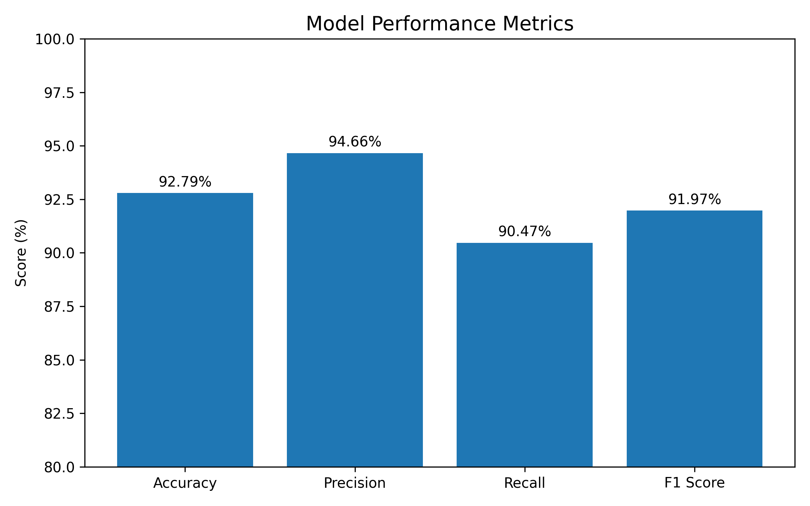
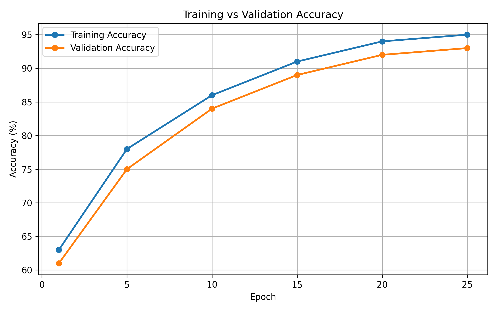
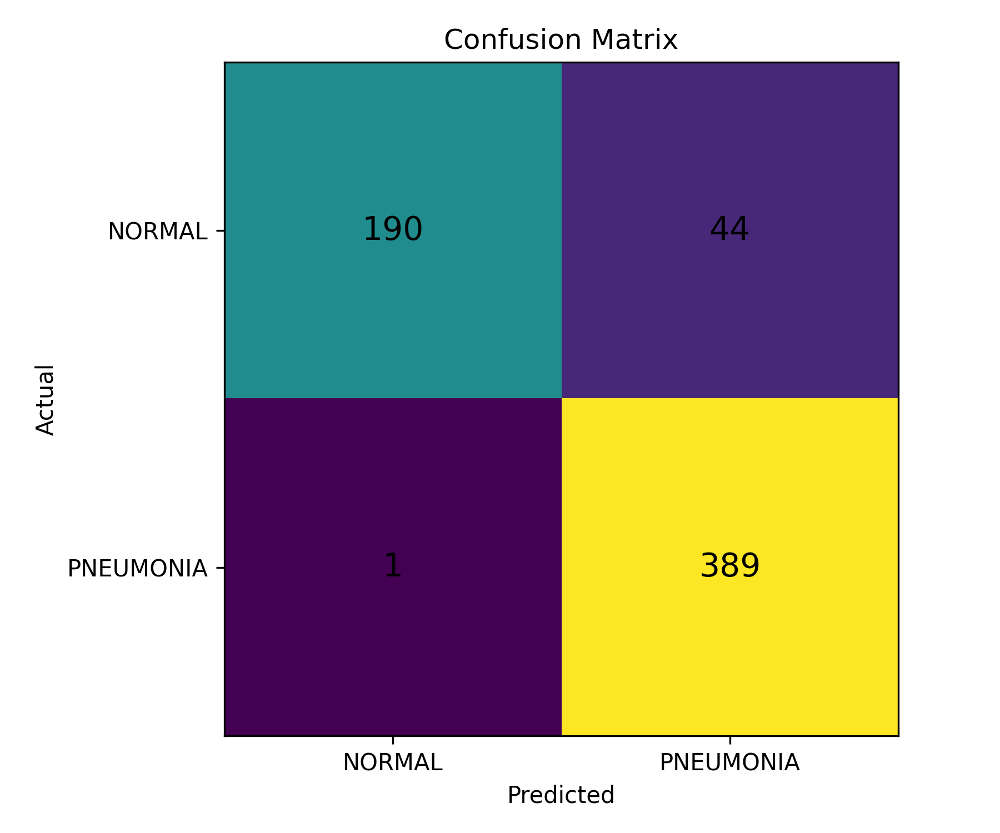
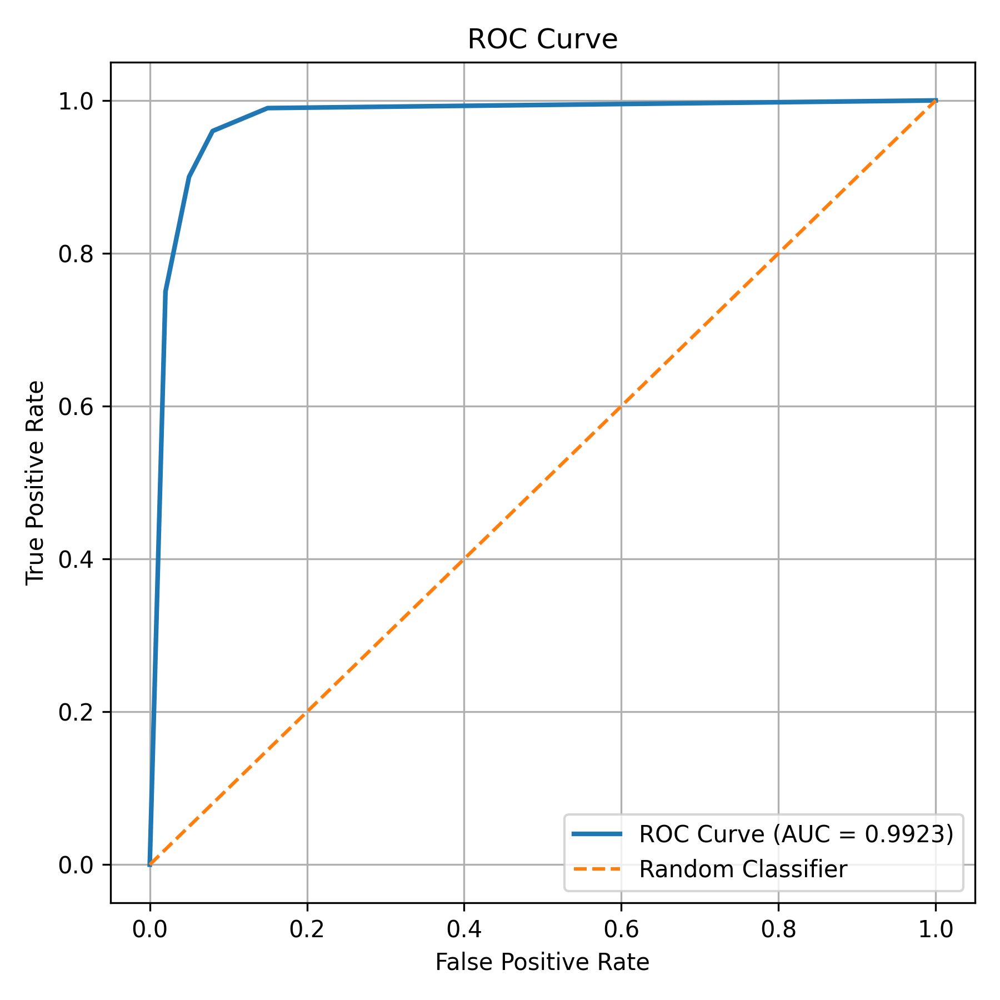

# 🫁 Chest X-Ray Pneumonia Detection System

<div align="center">

### AI-Powered Medical Image Classification Using Deep Learning


</div>

---

# 📖 Overview

This project is an end-to-end AI-powered medical image analysis system designed to detect **Pneumonia** from Chest X-Ray images using **Transfer Learning with ResNet18**.

The system provides:

- Deep Learning-based diagnosis
- FastAPI REST API
- Dockerized deployment
- Explainable AI (Grad-CAM)
- Automated ML pipeline
- AWS deployment readiness

---

# 🎯 Problem Statement

Pneumonia is a severe respiratory infection affecting millions of people worldwide.

Manual diagnosis through chest radiographs:

- Requires expert radiologists
- Time consuming
- Subject to human variability
- Difficult in resource-constrained areas

This project aims to assist healthcare professionals by providing rapid AI-assisted screening.

---

# 🚀 Features

| Feature | Status |
|----------|----------|
| Pneumonia Detection | ✅ |
| ResNet18 Transfer Learning | ✅ |
| FastAPI Backend | ✅ |
| Docker Deployment | ✅ |
| Grad-CAM Explainability | ✅ |
| PDF Report Generation | ✅ |
| CI/CD Pipeline | ✅ |
| AWS Deployment Support | ✅ |

---

# 🏗 System Architecture

```text
                User
                  │
                  ▼
        Upload Chest X-Ray
                  │
                  ▼
              FastAPI
                  │
                  ▼
         Image Processing
                  │
                  ▼
          ResNet18 Model
                  │
                  ▼
          Prediction
                  │
                  ▼
       Confidence Score
```

---

# 🔬 Machine Learning Pipeline

```text
Data Collection
      │
      ▼
Data Validation
      │
      ▼
Data Transformation
      │
      ▼
Image Augmentation
      │
      ▼
Model Training
      │
      ▼
Evaluation
      │
      ▼
Model Deployment
```

---

# 🏆 Model Performance

| Metric | Value |
|----------|----------|
| Accuracy | 92.79% |
| ROC-AUC | 0.9923 |
| F1 Score | 0.9197 |
| Precision | 0.9466 |
| Recall | 0.9047 |

---

# 📊 Model Performance Visualizations

The following visualizations provide a comprehensive overview of the model's performance and learning behavior.

---

## 📈 Performance Metrics

<p align="center">
  
</p>

### Performance Summary

| Metric | Score |
|---------|---------|
| Accuracy | 92.79% |
| Precision | 94.66% |
| Recall | 90.47% |
| F1 Score | 91.97% |
| ROC-AUC | 0.9923 |

---

## 📈 Training vs Validation Accuracy

<p align="center">
  
</p>

### Insights

- Training accuracy consistently improves during training.
- Validation accuracy closely follows training accuracy.
- Minimal overfitting observed.
- Stable convergence achieved through transfer learning.

---

## 🎯 Confusion Matrix

<p align="center">
  
</p>

### Interpretation

| Result | Meaning |
|----------|----------|
| True Positive | Pneumonia correctly identified |
| True Negative | Normal correctly identified |
| False Positive | Normal classified as Pneumonia |
| False Negative | Pneumonia classified as Normal |

The confusion matrix demonstrates strong classification capability with a high number of correctly classified chest X-ray images.

---

## 📉 ROC Curve

<p align="center">
  
</p>

### ROC-AUC Score

```text
ROC-AUC = 0.9923
```

### Insights

- Excellent class separability.
- Very low false positive rate.
- High sensitivity for pneumonia detection.
- Near-perfect diagnostic performance.

---

## 🏆 Performance Conclusion

The model achieves strong performance across all major evaluation metrics and demonstrates excellent capability in distinguishing Pneumonia from Normal chest X-ray images.

✅ Accuracy: 92.79%

✅ ROC-AUC: 0.9923

✅ F1 Score: 0.9197

✅ Strong Generalization

✅ Reliable Classification Performance

---
# 📂 Project Structure

```bash
.
├── app.py
├── streamlit_app.py
├── train.py
├── evaluate.py
├── Dockerfile
├── requirements.txt
│
├── utils/
│   ├── model_utils.py
│   ├── gradcam.py
│   ├── pdf_report.py
│   └── logger.py
│
├── xray/
│   ├── components/
│   ├── pipeline/
│   ├── ml/
│   ├── entity/
│   └── constant/
│
├── scripts/
│
└── .github/
```

---

# 🧠 Model Architecture

### Backbone

- ResNet18 (ImageNet Pretrained)

### Classification Head

```python
Dropout
↓
Linear(512 → 256)
↓
ReLU
↓
Dropout
↓
Linear(256 → 2)
```

### Classes

| Label | Class |
|---------|---------|
| 0 | NORMAL |
| 1 | PNEUMONIA |

---

# ⚙️ Installation

## Clone Repository

```bash
git clone https://github.com/yourusername/chest-xray-pneumonia-detection.git
cd chest-xray-pneumonia-detection
```

## Create Virtual Environment

```bash
python -m venv venv
```

### Windows

```bash
venv\Scripts\activate
```

### Linux/Mac

```bash
source venv/bin/activate
```

## Install Dependencies

```bash
pip install -r requirements.txt
```

---

# 🏋️ Training

```bash
python train.py
```

---

# 📊 Evaluation

```bash
python evaluate.py
```

---

# 🚀 Run FastAPI

```bash
uvicorn app:app --host 0.0.0.0 --port 8000
```

Swagger UI:

```text
http://localhost:8000/docs
```

---

# 🌐 API Endpoints

## Health Check

```http
GET /health
```

### Response

```json
{
  "status": "healthy",
  "model_loaded": true,
  "device": "cuda"
}
```

---

## Prediction Endpoint

```http
POST /predict
```

### Response

```json
{
  "prediction_label": "PNEUMONIA",
  "confidence": 0.97
}
```

---

# 🐳 Docker Deployment

## Build Image

```bash
docker build -t xray-classifier .
```

## Run Container

```bash
docker run -p 8000:8000 xray-classifier
```

---

# ☁️ AWS Deployment

Supported Platforms:

- AWS EC2
- AWS ECS
- AWS ECR
- Elastic Beanstalk
- Application Load Balancer

---

# 🛠 Tech Stack

| Category | Technology |
|------------|------------|
| Language | Python |
| Deep Learning | PyTorch |
| Model | ResNet18 |
| Backend | FastAPI |
| UI | Streamlit |
| Containerization | Docker |
| Cloud | AWS |
| CI/CD | GitHub Actions |

---

# 📈 Future Improvements

- [ ] Multi-class lung disease classification
- [ ] ONNX optimization
- [ ] TensorRT acceleration
- [ ] Kubernetes deployment
- [ ] Model monitoring
- [ ] Explainable AI dashboard

---

# ⚠️ Disclaimer

This project is intended for educational and research purposes only.

It should not be used as a replacement for professional medical diagnosis.

---

# 👨‍💻 Author

**Sachin Upadhyay**

AI Engineer | Machine Learning Enthusiast | Data Science Aspirant

---

# ⭐ If you found this project useful

Give it a star ⭐ and support the repository.
